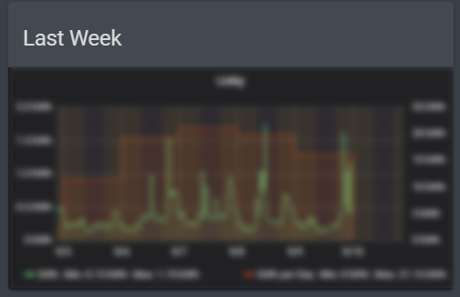

# Linky

Enedis equipment that provides power consumption.  
Unfortunately, data are only available on the $à%*!... Enedis website.

## Principle

1. Scrap (_\*crap\*_) the Enedis website using credentials
1. Convert data from website to JSON
1. Inject JSON in InfluxDB
1. Connect Grafana to influxDB instance
1. Display Grafana graph in HA iframe

## Data scrapping

Thanks to [barasher/linky-to-influxdb](https://github.com/barasher/linky-to-influxdb).

## _My stack_

1. Inject the _barasher_ script inside a Docker image
1. Create a crontab inside the image that triggers the _linky-to-influxdb_ script.
1. To handle missing days, i slightly modify the _linky-to-influxdb_ script
  - if a file with the `YYYYMMDD` pattern is detected in the arbitrary `./schedule` folder in the image, it will launch the script for this day
  
  
## InfluxDB

the hass.io [InfluxDB](https://github.com/hassio-addons/addon-influxdb) add-on.

The addon can be used to create the right request via the _Explore_ feature.

## Grafana 

the hass.io [Grafana](https://github.com/hassio-addons/addon-grafana) add-on.

The Influxdb database must be configured in Grafana.  
After creating the panel using the previous Influxdb request, Grafana can provide a share link that can be integrated in a Home assitant [iframe](https://www.home-assistant.io/lovelace/iframe/).

